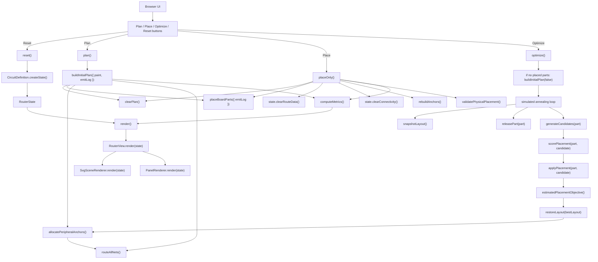
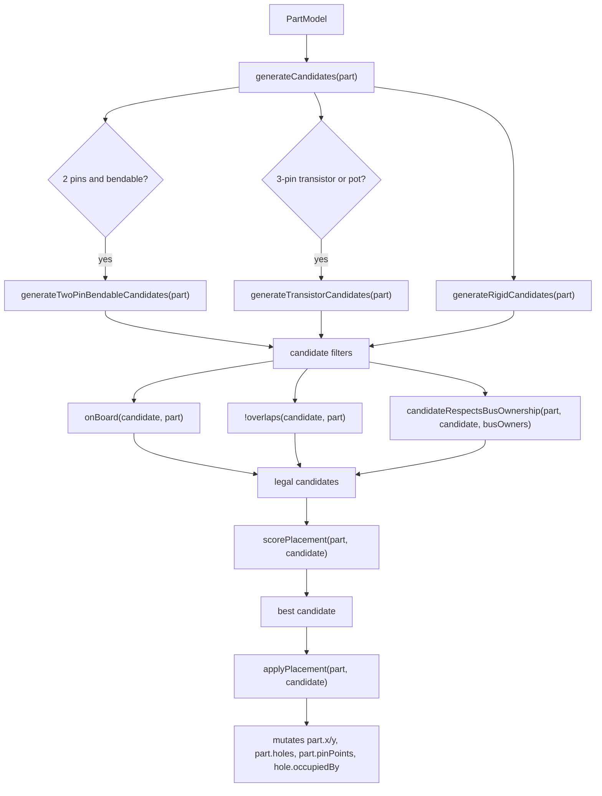
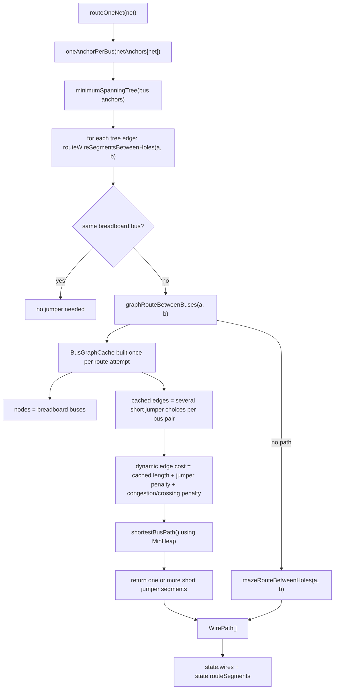
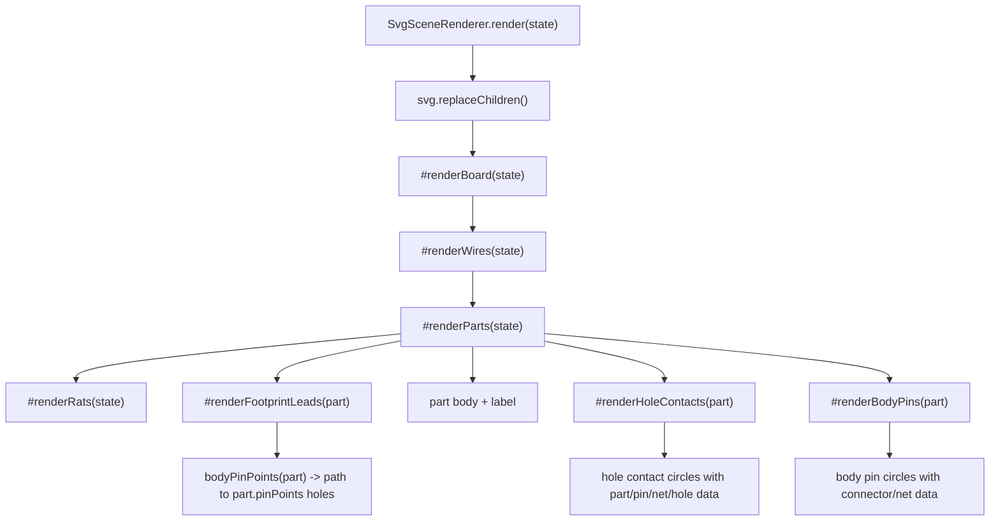
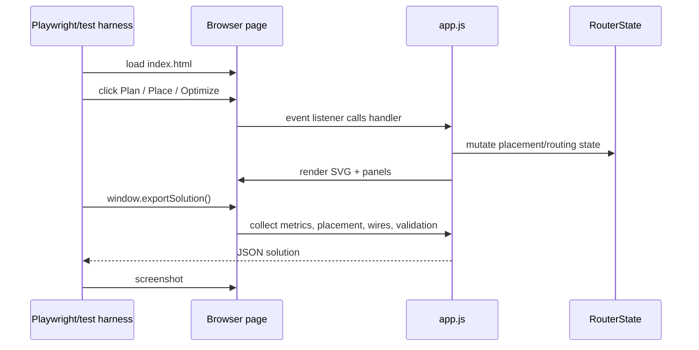

# Breadboard Router Prototype Program Flow

This diagram is a working map of the current prototype. It is meant to show
what owns data, what mutates state, and what returns derived output.

## Runtime Flow



## Data Ownership

```mermaid
flowchart LR
  Xml["fuzz_netlist.xml-derived net list"] --> NetSpecs["xmlCircuitNets"]
  Synthetic["V1 synthetic battery nets"] --> NetSpecs
  PartSpecs["sampleParts"] --> CircuitDefinition
  NetSpecs --> CircuitDefinition
  BoardSpec["board spec"] --> CircuitDefinition

  CircuitDefinition -->|createState()| RouterState
  RouterState --> Parts["PartModel[]"]
  RouterState --> Board["BreadboardModel"]
  RouterState --> Wires["WirePath[]"]
  RouterState --> Rats["ratline list"]
  RouterState --> Anchors["netAnchors / usedBuses / peripheralLanes"]
  RouterState --> Validation["modelValidation / validation"]
  RouterState --> MetricsState["metrics"]

  Board --> Holes["Hole objects: row, col, bus, x, y, occupiedBy"]
  Parts --> Pins["PinModel[]: connector id, pin name, net"]
```

## Candidate Placement Pipeline



## Graph Routing Pipeline



## Render Pipeline



## Export / Automation Flow


